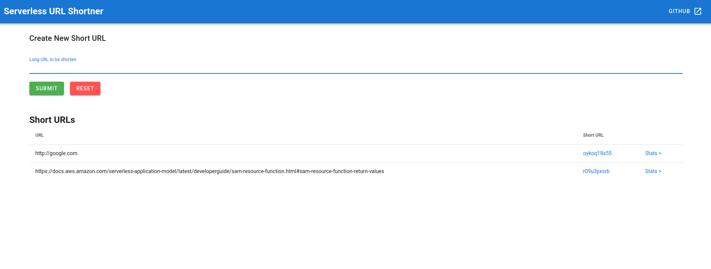
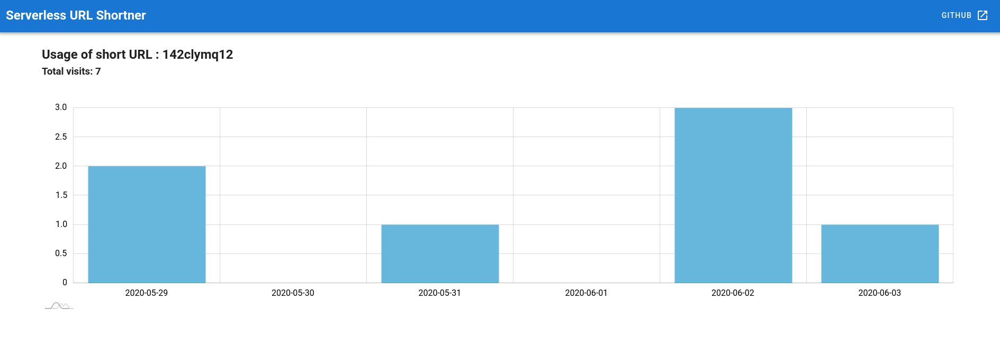

# Fully Serverless URL Shortner
## with AWS Lambda, API Gateway, S3, SNS, DynamoDB, VueJS

### Functionality:
1. Generate a short URL
2. List short URLs
3. Statistics on visits of a particular short url as a graph.

Architecture is as follows:

1. S3 web site hosting is used to host the frontend.
2. API Gateway is used to communicate with backend.
3. Generated short url will be saved in DynamoDB.
4. Individual visits and visit count will be saved/updated in DynamoDB.
5. Used single table design with DyanmoDB.
6. SNS used to communicate/trigger count and statistics functions.

## Prerequisites

* Need to have sam cli and npm installed


## How to install
1. Clone the repository

2. Goto the __backend__ directory, and run:
```
sam build
sam deploy -g
```
providing Stack Name, region etc.

3. Copy below values from the output:

```
ApiGatewayBaseUrl
PublicWebSiteURL
FrontendWebSiteBucket
```

4. Goto __frontend__ directory.

5. Copy __.env.example__ to __.env__ and replace the values of `VUE_APP_API_BASE_URL` with above `ApiGatewayBaseUrl` value with a __slash__ end of it.

6. Run `npm install`

7. Run `npm run build`

This will create the build for production in __dist__ directory.

8. Then upload the build files to s3 web site using below command. Replace the value `FrontendWebSiteBucket`.

```
aws s3 cp dist s3://[FrontendWebSiteBucket] --recursive
```

9. Once done, you can access the system using the value of `PublicWebSiteURL`


## Deleting the stack

Within the backend directory, run 
```
aws cloudformation delete-stack --stack-name [StackName]
```

## Example screenshots
Add and List short urls: 


Stats of a single short url:
